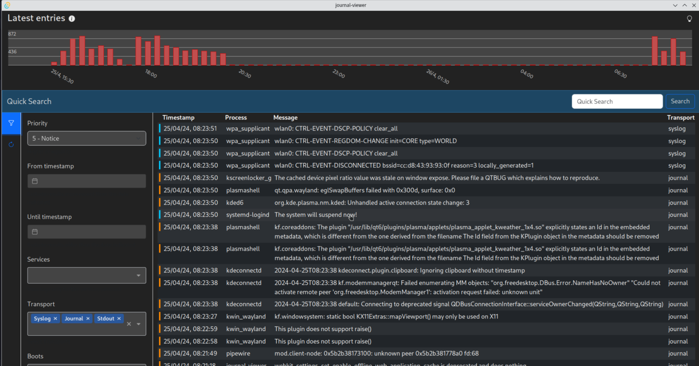
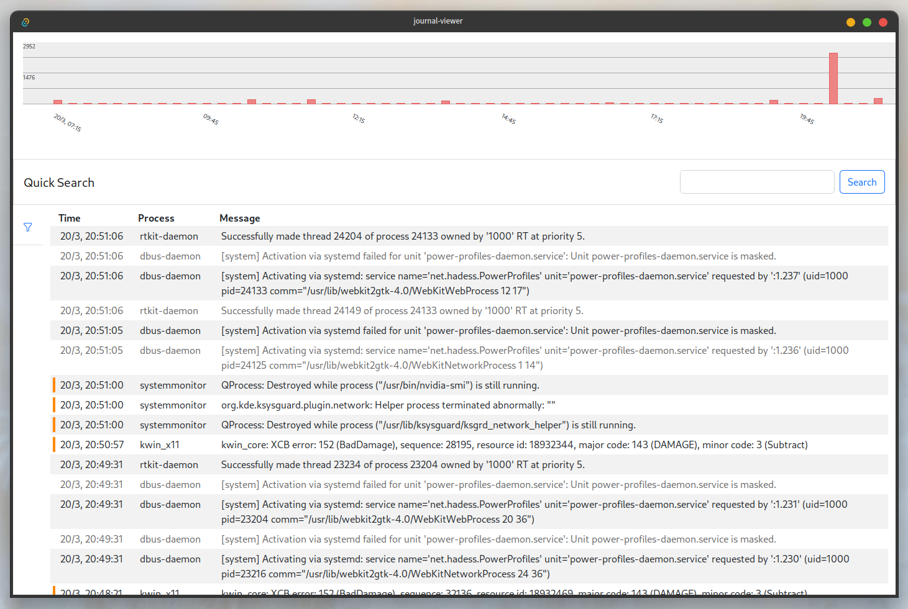

# Journal Viewer

A modern linux desktop application to visualize systemd logs.

## Dark Theme

## Light Theme

## Features

- Visualize at a glance the number of logs over time.
- A quick search to filter messages containing some text (case insensitive).
- A filter bar for more advanced filtering like by Priority, unit, date range... - WIP.
- Visualize different alerts levels with different styles.
- Infinite scrolling.

## Built with

- Rust
- Systemd Journald
- Tauri
- Vue
- Bootstrap
