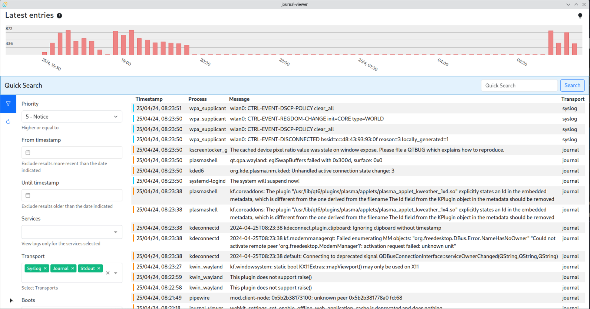

# Journal Viewer

A modern linux desktop application to visualize systemd logs.

## Dark Theme

## Light Theme

## Features

Hey all, I've built a journald log viewer for Linux, as the options that were available for the Linux desktops were a bit limited and it's nice to have tools to easily check our systems.

It is early stages and some functionality is still limited, but I thought I'd share to get some feedback and in case someone else find it useful already. Solution is built for Debian or Arch based distros. Links below

I did it also as a side project to get my hand dirty with something a bit more advanced than the typical beginner solutions in Rust. So any feedback is appreciated to improve :-)

Features:

- Visualize at a glance the number of logs over time.
- A quick search to filter messages containing some text (case insensitive).
- A filter bar for more advanced filtering like by Priority, unit, date range... - WIP.
- Visualize different alerts levels with different styles.
- Infinite scrolling.

Rust Learnings:

- Dynamic linking with systemd
- Use of Sync/Send traits to share raw pointers across threads
- Use of mem::replace
- Drop trait to free open journal
- Pipe output of invoking command

Tech Stack:

- Rust
- Systemd Journald
- Tauri
- Vue
- Bootstrap

<https://github.com/mingue/journal-viewer>
<https://aur.archlinux.org/packages/journal-viewer-bin>
<https://aur.archlinux.org/packages/journal-viewer>

## Built with

- Rust
- Systemd Journald
- Tauri
- Vue
- Bootstrap
